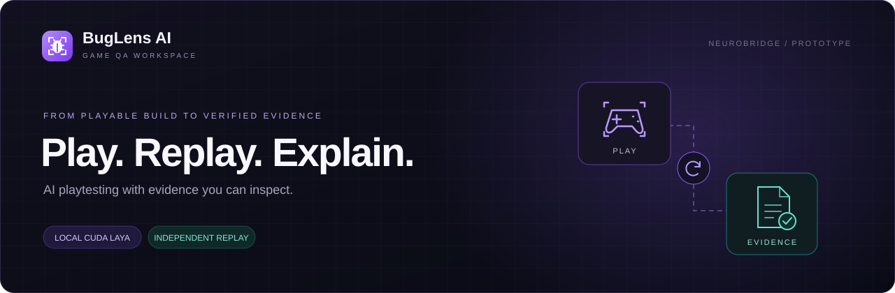
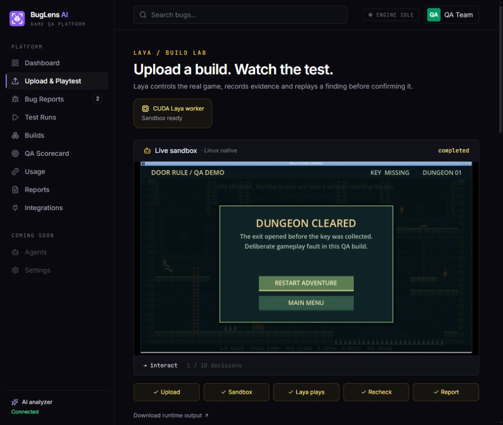
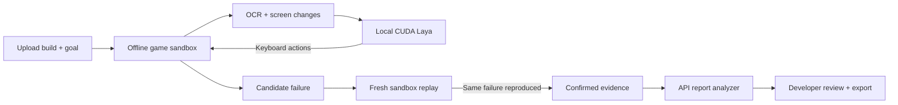
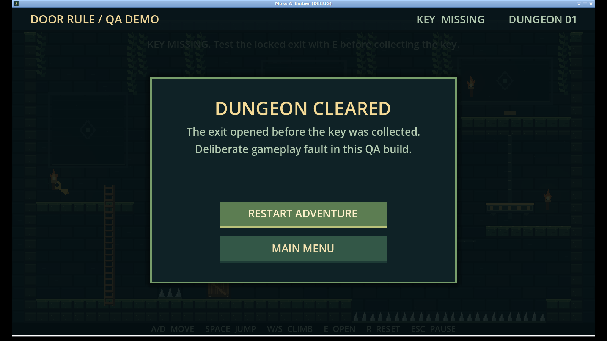
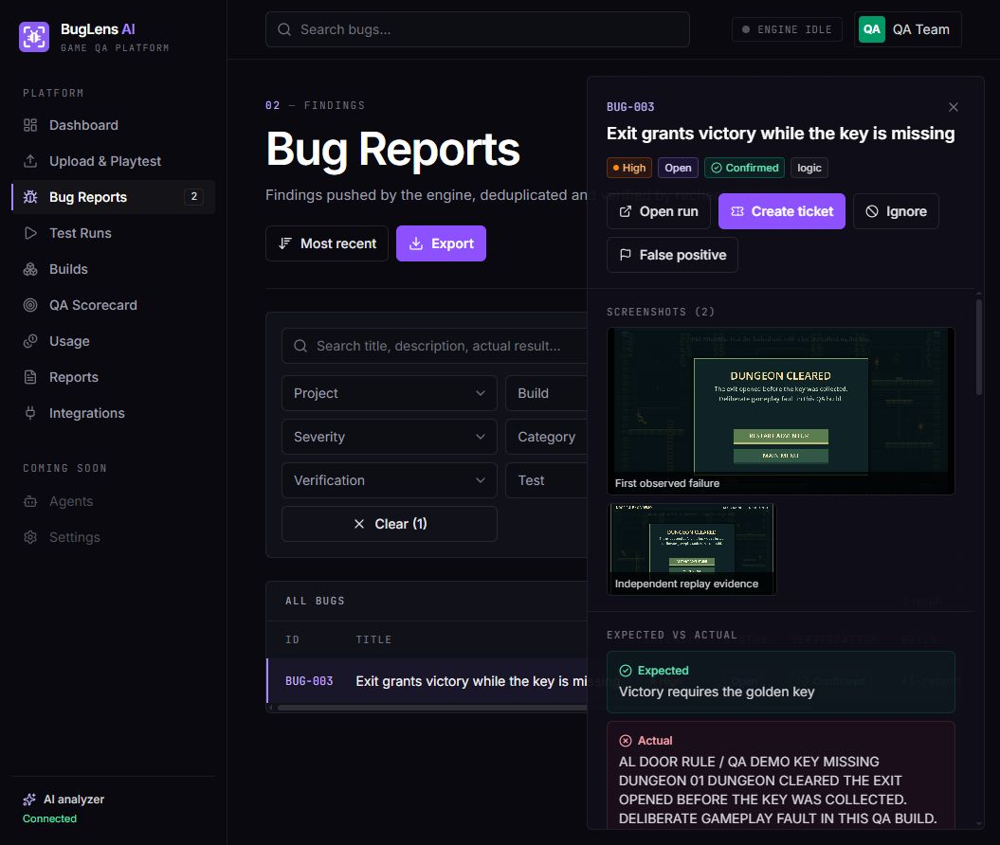
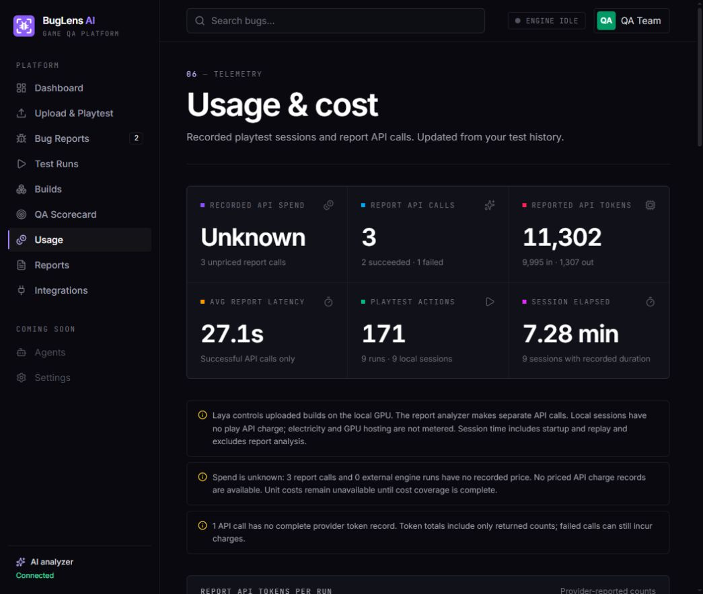
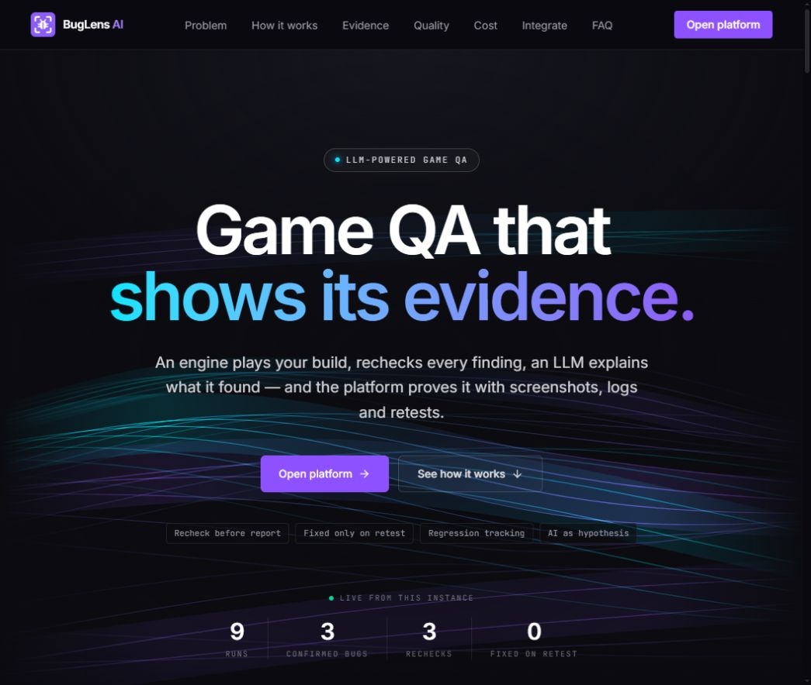

  

  <strong>Turn a playable build into a reproducible bug report.</strong> 
  Upload your game, watch the agent play, and inspect the evidence behind every confirmed finding.

  <a href="#how-it-works">How it works</a> ·
  <a href="#a-real-gameplay-failure">See the demo</a> ·
  <a href="#quality-testing">Quality testing</a> ·
  <a href="#technical-documentation">Documentation</a>

---

## Meet BugLens AI

BugLens AI is the game QA workspace in the **NeuroBridge** repository. It brings build uploads, agent playtesting, independent replay, evidence review and AI-written reports into one workflow.

The prototype runs a real game in an offline Docker sandbox. **Local CUDA Laya chooses keyboard actions.** When a supported detector observes a failure, the worker repeats the inputs in a fresh sandbox. A separate API model then explains the recorded evidence and drafts a report for a developer to review.

**Current scope:** native Linux game builds, keyboard input, runtime-error checks and a selected key/exit gameplay assertion. Windows execution through Wine is experimental.

*Actual prototype UI and recorded sandbox output. The pictured run uses a deliberately faulty test build.*

## How it works

### 01 · Describe the test

Upload a build ZIP containing the executable and its required assets. Give the project and build a name, describe the objective and controls, choose a decision budget, and select the available gameplay assertion when relevant. If a ZIP contains multiple executables, specify which one to launch.

For the included dungeon, the rule is simple: **the exit must stay locked until the player collects the golden key.**

### 02 · Watch the agent play

The worker launches the game inside an offline container and captures its screen and runtime output. Laya receives OCR text, screen-change measurements, the supplied goal and recent inputs; it selects from the supported keyboard actions. The UI exposes frames, actions, probabilities and events so the test can be inspected while it runs.

Laya is the **local gameplay policy**, not the report writer. In this implementation it uses text observations rather than reasoning directly over raw screenshots. For the key/exit test, a visible locked-door prompt narrows the action set to interact or wait; that scope is recorded in the event log.

### 03 · Reproduce before confirming

Runtime checks and the selected gameplay assertion produce candidate findings. The worker starts a **fresh container** and replays the recorded input sequence. The same failure must be observed again before the finding becomes confirmed. Both the first observation and the independent replay retain screenshot evidence.

A session that exhausts its budget without a confirmed failure is **inconclusive**. It does not certify that the game is bug-free.

### 04 · Explain the evidence

After confirmation, the trusted host sends screenshots, logs, the test objective and replay results to the configured API analyzer. The demonstrated model alias is **`cx/gpt-6.1-sol(high)`**. It returns a validated structured report with reproduction steps, expected versus actual behavior, evidence references, and possible causes and fixes.

The game container stays offline. The external model writes the report; it does not control gameplay. Root causes and suggested fixes are labeled **hypotheses**. If analysis fails, the verified finding remains available and analysis can be retried.

### 05 · Review and share

Inspect the original screenshots, replay evidence, runtime output and AI explanation in Bug Reports. Export reports as **HTML, Markdown or JSON**, or export the bug list as CSV. The Usage page shows persisted actions, session duration and provider token counts; unpriced API calls remain **Unknown**.

## A real gameplay failure

**Expected:** without the key, interacting with the exit should leave it locked.

**Observed:** the faulty build grants victory while its HUD still reports `KEY MISSING`.

The controlled demo starts beside the exit with no key. Laya selects the interaction, the assertion detects the contradiction, and a fresh sandbox reproduces it. This verifies the testing pipeline against a known defect; it is not a claim of discovering an unknown production bug.

<table>
  <tr>
    <th>First observed failure</th>
    <th>Independent replay</th>
  </tr>
  <tr>
    <td></td>
    <td></td>
  </tr>
</table>

*The faulty door lives in a separate test fixture. The normal game's key requirement remains intact.*

## Inside the workspace

| Surface | What it provides |
| :--- | :--- |
| **Upload & Playtest** | Build selection, test intent, captured frames and recorded model decisions |
| **Bug Reports** | Findings, verification state, screenshot evidence and AI report hypotheses |
| **Test Runs & Builds** | Build context and the history behind each test session |
| **Reports** | Shareable evidence and reproduction details |
| **Usage** | Recorded activity and API consumption, with explicit gaps in cost data |
| **Integrations** | Engine ingest API and SDK documentation; example wiring is distinct from an active connection |

<strong>View the Usage dashboard</strong>

*Local gameplay inference has no per-action API call. GPU hosting and electricity are not metered by this dashboard.*

<strong>View the product landing page</strong>

## Quality testing

**Prototype snapshot · 9 October 2026.** These are development results, not a production accuracy benchmark.

| Check | Recorded result |
| :--- | :--- |
| Automated backend tests | **52 passed**, covering API behavior, analysis validation, bug lifecycle, playtests and usage |
| Frontend verification | TypeScript checks and the Vite production build passed |
| Real sandbox sessions | **9:** 3 completed with confirmed findings, 5 inconclusive, 1 environment error |
| Confirmed findings | **3 records across 2 seeded defect types:** a runtime error and the door/key violation; the door test was repeated |
| Exploration inputs | **171 recorded actions**, excluding additional replay inputs |
| External report analysis | **2 successful calls, 1 failed response**; 11,302 known provider tokens from the successful calls |

API-boundary tests use mocked transport and do not spend live API credits. Real sessions and live report calls are counted separately. Historical token data for the failed call is incomplete, and API prices were not configured, so a total dollar cost is unavailable.

### What broke, and what remains limited

- **Windows execution:** Wine produced environment failures or inconclusive results. Native Linux builds are the demonstrated path; arbitrary Windows builds are not reliably supported yet.
- **Agent exploration:** some sessions repeated unproductive actions and exhausted their budgets. The agent has not demonstrated reliable navigation through arbitrary levels.
- **Report generation:** an initial API response failed structured validation. The schema and prompt were tightened, and subsequent real reports succeeded. Invalid responses remain visible as failures.
- **Cost reporting:** missing prices initially appeared as zero. Usage now preserves unknown costs instead of inventing a total. Broader scorecard telemetry still needs auditing.
- **Runtime classification:** detecting a script error does not prove the game process crashed; the distinction needs refinement.
- **Deployment:** the prototype runs on a development machine. A dedicated Linux GPU server, public-service authentication and quotas are still future work.

### Compared with today's manual QA

A human tester interprets game rules, explores the level, repeats a failure, captures evidence and writes a ticket. BugLens automates execution, evidence capture, replay and report drafting **within its supported checks**. A human still defines useful test intent, reviews the evidence and decides what to fix.

We have not run a controlled manual-versus-agent study, so we do not claim a measured time saving, cost saving or detection rate.

## The included game

**Moss & Ember** is an original Godot 4 dungeon puzzle-platformer: collect the key and reach the elevated exit, using ladders, a pushable crate and moving platforms. Its source, scenes, pixel art and sounds are included in [game/](game/).

The normal game and deliberately faulty QA fixtures are separate. The game is a reproducible test environment for the platform, with a playable level alongside controlled failures.

- [Game, controls and Windows export guide](game/README.md)
- [Door-rule fixture](tests/fixtures/door_rule/)
- [Runtime-error fixture](tests/fixtures/runtime_error/)

## Technical documentation

| Read this | For |
| :--- | :--- |
| [Build playtest guide](docs/BUILD_PLAYTEST.md) | Running the prototype, exporting a Linux build, supported input and sandbox limits |
| [AI integration](docs/AI_INTEGRATION.md) | Report model configuration, evidence payloads, validation and usage tracking |
| [Engine API](docs/ENGINE_API.md) | Sending engine findings and rechecks into the platform |
| [Python SDK](sdk/buglens_client.py) | A lightweight client for the ingest API |
| [Hackathon plan](PLAN.md) | Original project scope and planning context |

The platform uses **React + TypeScript**, **FastAPI**, **SQLite**, **Docker**, **CUDA Laya**, and a separate multimodal report API. The code is organized into [frontend/](frontend/), [backend/](backend/), [ai/](ai/), [sandbox/](sandbox/) and [tests/](tests/).

## License

Original project code and documentation are available under the [MIT License](LICENSE).
Moss & Ember's original assets retain their [game license](game/LICENSE.txt).
Dependencies, fonts and pretrained models retain their own licenses; see
[Third-party notices](THIRD_PARTY_NOTICES.md) for attribution and distribution notes.

---

<strong>Play the build. Reproduce the failure. Review the evidence.</strong>

